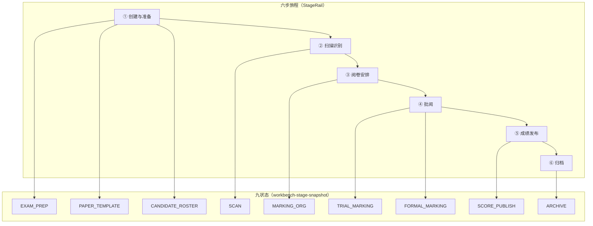

# 考试工作台六步旅程重构实现方案

> **适用范围**：`edu-practice-mark-vue` 考试详情工作台 `/teacher/exam-workspace/:examId/*`  
> **状态**：实施真源，替代已删除的旧考试模块、质量模块和综合前端重构建议文档  
> **版本**：v2.3  
> **最后更新**：2026-06-22  
> **关联真源**：`edu-mark` `ExamWorkbenchStageKey`、`src/stores/modules/markStage.ts`、`src/router/routes/exam-workspace.ts`、`src/constants/exam-workspace-menu.ts`、`docs/18-前端-edu-practice-mark-vue.md`

---

## 1. 结论

考试工作台保留后端 9 段业务状态，前端改为 6 步教师旅程导航：

```text
创建与准备 → 扫描识别 → 阅卷安排 → 批阅 → 成绩发布 → 归档
```

`overview` 是考试概览入口，不占步骤轨。`StageRail` 只展示 6 个旅程步；侧栏只展示当前旅程下的菜单项；**仅**带 `meta.layoutWide === true` 的单份批阅 / 复核沉浸页隐藏旅程轨与侧栏（见 §8.5、§8.6）。所有现有 `path`、`routeName`、`meta.markStageKey` 保持不变，只增补 `meta.journeyKey`、调整复核入口 `layoutWide` 与新前端聚合层。

旧文档中涉及 `a-steps`、修改路由 path、Tailwind 色值、硬编码 `#fff` / `#f0f0f0`、考试域与质量域混改的建议已经废弃，不得作为实施依据。

---

## 2. 当前源码事实

### 2.1 后端阶段真源

`edu-mark` 当前 `ExamWorkbenchStageKey` 是 9 段：

| 顺序 | 后端阶段键 | 显示含义 |
|---|---|---|
| 1 | `EXAM_PREP` | 考试准备 |
| 2 | `PAPER_TEMPLATE` | 模板制卷 |
| 3 | `CANDIDATE_ROSTER` | 考生名册 |
| 4 | `SCAN` | 扫描识别 |
| 5 | `MARKING_ORG` | 阅卷组织 |
| 6 | `TRIAL_MARKING` | 试评 |
| 7 | `FORMAL_MARKING` | 正评 |
| 8 | `SCORE_PUBLISH` | 成绩发布 |
| 9 | `ARCHIVE` | 归档复盘 |

不得新增 `GRADE_REVIEW`，不得使用旧键 `TRIAL_MARK` / `FORMAL_MARK`。

### 2.2 前端当前基线

当前 `src/constants/exam-workspace-menu.ts` 已有 5 个 section：`overview`、`prep`、`scan`、`marking`、`post-exam`。问题不是完全无结构，而是 `exam-workspace-layout.vue` 在侧栏一次性渲染所有 section 和所有 item，导致 30+ 功能入口同时暴露；`marking` 同时包含阅卷安排、试评、正评、质控；`post-exam` 同时包含成绩发布和归档。

重构目标是从“5 section 全量侧栏渲染”迁移到“6 journey 顶部旅程轨 + 当前 journey 动态侧栏”。

---

## 3. 范围边界

### 3.1 必做

- 新增 6 步旅程聚合模型，不改后端 9 段快照。
- `StageRail` 在考试工作台 layout 统一渲染，子页不再重复渲染全局阶段轨。
- 侧栏按 `journeyKey` 动态渲染当前旅程菜单；`mark` 旅程保留「试评 / 正评 / 质控」子组。
- `route.meta.journeyKey` 补齐到所有考试工作台子路由。
- `layoutWide` 沉浸页与含业务对象 ID 的详情页：隐藏旅程轨与侧栏；`noCache` 仅影响 keep-alive，不隐藏导航。
- **路由级 `layoutWide` 拆分（§8.6）**：移除 `TeacherExamWorkspaceMarkingReview` 的 `layoutWide`；保留 `ReviewWorkspace` / `ReviewTaskDetail` / `MarkingTaskDetail` 的 `layoutWide`。
- **`goSmartExamEntry` 修正**：AI 待确认场景改跳 `TeacherExamWorkspaceReviewBatchConfirm`，不再跳空的 `MarkingReview`。
- 考试切换时避免复用旧考试的 `taskId`、复核任务 ID、详情页 query。
- 更新 `docs/18-前端-edu-practice-mark-vue.md`，修正阶段键和六步方案索引。

### 3.2 不做

- 不改 `edu-mark` `ExamWorkbenchStageKey`、接口返回和数据库结构。
- 不改 `edu-quality` 的 `/quality/*` 页面和 AI 任务链。
- 不改 `edu-course`、`edu-practice-web-vue`。
- 不引入 `a-steps`，不使用 Tailwind 色值，不写硬编码视觉色值。
- 不重命名现有 route name，不修改现有 path。

---

## 4. 产品需求视角

### 4.1 使用角色

| 角色 | 主要目标 | 对六步旅程的关注点 |
|---|---|---|
| 任课教师 | 进入考试后快速知道下一步该处理什么 | 当前阶段、建议处理项、常用入口不被 30+ 菜单淹没 |
| 阅卷负责人 | 组织阅卷、分派任务、跟踪试评和正评质量 | `assign` 与 `mark` 的边界清晰，试评、正评、质控入口可快速切换 |
| 教务 / 管理员 | 查看考试进展、确认成绩发布、归档导出 | 发布前检查、成绩异常、归档材料完整性 |
| 现场扫描操作员 | 处理扫描批次、识别异常、设备和 OCR 状态 | `scan` 旅程内只看到扫描相关入口，异常批次优先可见 |

现场扫描操作员只指考试工作台内的教师侧关联场景，本方案不扩展独立 Kiosk 或扫描客户端。

### 4.2 核心场景

| 场景 | 用户路径 | 成功标准 |
|---|---|---|
| 新建考试后进入准备 | 考试列表进入 `overview` 或 `prep`，看到「创建与准备」为当前旅程 | 能找到模板、答卷页、母版、名册、印刷包；不会误入扫描或批阅入口 |
| 扫描中处理异常 | 顶部点击「扫描识别」或建议阶段跳转 | 按 `scanAttentionCount` 优先进入需处理的扫描入口；扫描监控、账本、设备、OCR 在同一侧栏内 |
| 组织阅卷 | 顶部点击「阅卷安排」 | 只展示阅卷组织和分派方案，不混入试评、正评任务池 |
| 试评 / 正评执行 | 建议阶段为 `TRIAL_MARKING` 时点横幅；普通点击「批阅」进入正评 | 横幅尊重细阶段建议；顶部旅程尊重教师主工作流，默认进入正评任务池 |
| 单人 AI 待确认 | 考试列表「进入考试」或准备页智能入口 | 进入 `ReviewBatchConfirm` 批量复核列表，保留六步轨与 mark 侧栏；单题进入 `ReviewWorkspace` 后沉浸 |
| 发布成绩 | 顶部点击「成绩发布」 | 成绩汇总、发布、缺考、申诉入口在同一旅程下 |
| 归档复盘 | 顶部点击「归档」 | 归档包、统计、经验库、导出入口在同一旅程下 |

### 4.3 产品验收口径

- 进入考试详情后，首屏必须能同时判断：当前考试、当前旅程、建议处理阶段、当前旅程可用入口。
- 顶部只展示 6 步教师旅程，不暴露后端 9 段枚举细节。
- 细阶段问题不得被隐藏：建议横幅、tooltip、概览明细仍展示 `PAPER_TEMPLATE`、`TRIAL_MARKING` 等细阶段文案。
- `overview` 是概览入口，不参与 6 步进度，不在步骤轨上高亮。
- 本轮目标是降低入口噪声和明确当前工作上下文，不改变阅卷业务顺序、权限、接口、统计口径。

---

## 5. 页面结构与交互

### 5.1 页面布局

考试工作台标准页面由 4 层组成：

| 区域 | 内容 | 显示规则 |
|---|---|---|
| Header | 返回列表、考试切换、刷新、可选概览入口 | 所有工作台页面保留；沉浸页也保留返回和考试上下文 |
| 旅程轨 | 6 步 `StageRail` / `UiArrowTimeline` | `overview`、普通功能页显示；**仅** `layoutWide === true` 的沉浸页隐藏 |
| 动态侧栏 | 当前 `journeyKey` 下的菜单组 | 普通功能页显示；移动端进入 drawer；**仅** `layoutWide` 沉浸页隐藏 |
| 主内容 | 建议横幅、当前子页 `router-view` | 所有页面显示；横幅按快照和建议阶段决定 |

### 5.2 顶部旅程轨

- 展示顺序固定为：创建与准备、扫描识别、阅卷安排、批阅、成绩发布、归档。
- 点击旅程步调用 `navigateToJourneyStep`，进入该旅程默认入口。
- 当前路由为 `overview` 时，旅程轨不高亮任何步骤；建议横幅仍可提示后端建议阶段。
- hover / focus 展示聚合后的 `statusText`，若聚合来自多个细阶段，tooltip 需要包含细阶段名称。
- 移动端宽度不足时允许横向滚动或收敛为阶段选择器，但不能遮挡 Header、侧栏 drawer 触发按钮和主内容标题。

### 5.3 动态侧栏

- 侧栏只渲染 `getMenuGroupsForJourney(activeJourneyKey)` 返回的菜单组。
- `mark` 旅程必须分为「试评」「正评」「质控」三个组；不要把三组压成一个无层级长列表。
- 侧栏折叠态只展示当前旅程内的菜单图标，不展示其他旅程入口。
- 移动端 drawer 打开后只能看到当前旅程菜单；切换旅程后 drawer 内容同步刷新。
- 详情页通过 `EXAM_WORKSPACE_MENU_ROUTE_FALLBACK` 选中来源菜单，但沉浸状态下不显示侧栏。

### 5.4 异常与空状态

| 状态 | 页面表现 | 处理口径 |
|---|---|---|
| 无 `examId` | 不渲染旅程轨和侧栏，主内容显示明确错误或返回入口 | 不调用阶段快照接口 |
| 快照加载中 | Header 和路由内容可显示，旅程轨使用加载态或骨架 | 不制造默认 completed / pending 结果 |
| 快照加载失败 | 旅程轨显示错误态，建议横幅显示失败说明和重试 | 不吞掉接口错误 |
| 无权限 / 接口 403 | 主内容显示权限错误，导航不伪装成功 | 不跳转到其他考试或默认概览 |
| 后端未知阶段键 | 前端类型或 store 显式失败 | 不用 `pending` 兜底隐藏协议问题 |

---

## 6. 信息架构

```text
Layer A：教师旅程导航（6 步）
  StageRail / UiArrowTimeline，仅用于导航聚合和认知减负

Layer B：后端业务状态（9 段）
  workbench-stage-snapshot，仍用于进度、建议阶段、诊断、横幅和数据库事实

Layer C：功能入口（当前约 30+ 项）
  按 journeyKey 动态筛选，当前旅程内可再分子组
```

旅程步是导航聚合；`markStageKey` 是业务状态粒度；菜单项是具体功能入口。三者不能互相替代。

---

## 7. 六步旅程定义

| # | `journeyKey` | 展示标题 | 聚合的 `markStageKey` | 默认路由 | 侧栏策略 |
|---|---|---|---|---|---|
| - | `overview` | 考试概览 | 不参与步骤轨 | `TeacherExamWorkspaceOverview` | 固定入口或 header 入口 |
| 1 | `prep` | 创建与准备 | `EXAM_PREP`、`PAPER_TEMPLATE`、`CANDIDATE_ROSTER` | `TeacherExamWorkspacePrep` | 准备工作台、模板、名册、印刷包 |
| 2 | `scan` | 扫描识别 | `SCAN` | 动态：`resolveScanStageEntryRoute` | 扫描批次、监控、账本、设备、OCR |
| 3 | `assign` | 阅卷安排 | `MARKING_ORG` | `TeacherExamWorkspaceMarkingOrg` | 阅卷安排、分派方案 |
| 4 | `mark` | 批阅 | `TRIAL_MARKING`、`FORMAL_MARKING` | `TeacherExamWorkspaceMarkingTaskPool` | 试评、正评、质控 |
| 5 | `publish` | 成绩发布 | `SCORE_PUBLISH` | `TeacherExamWorkspaceScoreSummary` | 成绩确认、发布、缺考、申诉 |
| 6 | `archive` | 归档 | `ARCHIVE` | `TeacherExamWorkspaceArchivePackage` | 归档、统计、经验库、导出 |

`TRIAL_MARKING` 不单独占顶部步骤，但必须作为 `mark` 旅程内的「试评」子组保留入口。后端建议阶段为 `TRIAL_MARKING` 时，「前往建议阶段」必须跳试评任务池；用户点击顶部「批阅」旅程步时默认跳正评任务池。

---

## 8. 路由契约

### 8.1 RouteMeta

在 `src/types/env.d.ts` 补：

```typescript
/** 考试工作台六步旅程键；overview 不参与 StageRail */
journeyKey?: 'overview' | 'prep' | 'scan' | 'assign' | 'mark' | 'publish' | 'archive'
```

如果 `ExamJourneyKey` 类型放在 `src/constants/exam-journey.ts`，`env.d.ts` 不直接 import 运行时代码；可复制联合字面量，或从纯 type 文件导入 type。

### 8.2 路由映射

| `journeyKey` | 路由范围 |
|---|---|
| `overview` | `overview` |
| `prep` | `prep`、`print-package`、`paper-template`、`paper-template/answer-sheet`、`paper-template/master`、`candidate-roster` |
| `scan` | `scan/*` |
| `assign` | `marking-org`、`marking-org/assignment` |
| `mark` | `trial/*`、`marking/*`，含批阅、复核、仲裁、抽检和详情页 |
| `publish` | `score/*` |
| `archive` | `archive/*` |

所有现有 `meta.markStageKey` 保持，`activeStageKey` 仍用它保障业务阶段横幅和建议阶段判断。

### 8.3 完整路由矩阵

| 菜单键 | 路由名 | 当前 path | `journeyKey` | `markStageKey` | 详情 / 沉浸 | 侧栏 fallback |
|---|---|---|---|---|---|---|
| `overview` | `TeacherExamWorkspaceOverview` | `overview` | `overview` | `EXAM_PREP` | 否 | - |
| `prep` | `TeacherExamWorkspacePrep` | `prep` | `prep` | `EXAM_PREP` | 否 | - |
| `print-package` | `TeacherExamWorkspacePrintPackage` | `print-package` | `prep` | `EXAM_PREP` | 否 | - |
| `paper-template` | `TeacherExamWorkspacePaperTemplate` | `paper-template` | `prep` | `PAPER_TEMPLATE` | 否 | - |
| `answer-sheet` | `TeacherExamWorkspaceAnswerSheet` | `paper-template/answer-sheet` | `prep` | `PAPER_TEMPLATE` | 否 | - |
| `paper-master` | `TeacherExamWorkspacePaperMaster` | `paper-template/master` | `prep` | `PAPER_TEMPLATE` | 否 | - |
| `candidate-roster` | `TeacherExamWorkspaceCandidateRoster` | `candidate-roster` | `prep` | `CANDIDATE_ROSTER` | 否 | - |
| `scan-batches` | `TeacherExamWorkspaceScanBatches` | `scan/batches` | `scan` | `SCAN` | 否 | - |
| `scan-monitor` | `TeacherExamWorkspaceScanMonitor` | `scan/monitor` | `scan` | `SCAN` | 否（`noCache`，**仍显示**轨/侧栏） | - |
| `scan-ledger` | `TeacherExamWorkspaceScanLedger` | `scan/ledger` | `scan` | `SCAN` | 否 | - |
| `scan-devices` | `TeacherExamWorkspaceScanDevices` | `scan/devices` | `scan` | `SCAN` | 否 | - |
| `scan-ocr` | `TeacherExamWorkspaceScanOcr` | `scan/ocr` | `scan` | `SCAN` | 否 | - |
| `marking-org` | `TeacherExamWorkspaceMarkingOrg` | `marking-org` | `assign` | `MARKING_ORG` | 否 | - |
| `marking-assignment` | `TeacherExamWorkspaceReviewAssignment` | `marking-org/assignment` | `assign` | `MARKING_ORG` | 否 | - |
| `trial-pool` | `TeacherExamWorkspaceTrialTaskPool` | `trial/task-pool` | `mark` | `TRIAL_MARKING` | 否 | - |
| `trial-progress` | `TeacherExamWorkspaceTrialProgress` | `trial/progress` | `mark` | `TRIAL_MARKING` | 否 | - |
| `marking-review-batch` | `TeacherExamWorkspaceReviewBatchConfirm` | `marking/review-batch` | `mark` | `FORMAL_MARKING` | 否 | - |
| `marking-pool` | `TeacherExamWorkspaceMarkingTaskPool` | `marking/task-pool` | `mark` | `FORMAL_MARKING` | 否 | - |
| `marking-task-detail` | `TeacherExamWorkspaceMarkingTaskDetail` | `marking/task/:taskId` | `mark` | `FORMAL_MARKING` | 是（`layoutWide`） | `marking-pool` |
| `marking-progress` | `TeacherExamWorkspaceMarkingProgress` | `marking/progress` | `mark` | `FORMAL_MARKING` | 否 | - |
| `marking-arbitration` | `TeacherExamWorkspaceMarkingArbitration` | `marking/arbitration` | `mark` | `FORMAL_MARKING` | 否 | - |
| `marking-quality` | `TeacherExamWorkspaceMarkingQuality` | `marking/quality` | `mark` | `FORMAL_MARKING` | 否 | - |
| `marking-review` | `TeacherExamWorkspaceMarkingReview` | `marking/review` | `mark` | `FORMAL_MARKING` | 否（**Phase 4 移除 `layoutWide`**，显示轨/侧栏） | - |
| `review-workspace` | `TeacherExamWorkspaceReviewWorkspace` | `marking/review/:taskId` | `mark` | `FORMAL_MARKING` | 是（`layoutWide`） | `marking-review` |
| `review-task-detail` | `TeacherExamWorkspaceReviewTaskDetail` | `marking/review/:taskId/detail` | `mark` | `FORMAL_MARKING` | 是（`layoutWide`） | `marking-review` |
| `score-summary` | `TeacherExamWorkspaceScoreSummary` | `score/summary` | `publish` | `SCORE_PUBLISH` | 否 | - |
| `score-release` | `TeacherExamWorkspaceScoreRelease` | `score/release` | `publish` | `SCORE_PUBLISH` | 否 | - |
| `score-absence` | `TeacherExamWorkspaceScoreAbsence` | `score/absence` | `publish` | `SCORE_PUBLISH` | 否 | - |
| `score-appeal` | `TeacherExamWorkspaceScoreAppeal` | `score/appeal` | `publish` | `SCORE_PUBLISH` | 否 | - |
| `archive-package` | `TeacherExamWorkspaceArchivePackage` | `archive/package` | `archive` | `ARCHIVE` | 否 | - |
| `archive-statistics` | `TeacherExamWorkspaceArchiveStatistics` | `archive/statistics` | `archive` | `ARCHIVE` | 否 | - |
| `archive-grading-experience` | `TeacherExamWorkspaceGradingExperience` | `archive/grading-experience` | `archive` | `ARCHIVE` | 否 | - |
| `archive-exports` | `TeacherExamWorkspaceArchiveExports` | `archive/exports` | `archive` | `ARCHIVE` | 否 | - |

矩阵中的 path 是当前实现口径，实施时以 `src/router/routes/exam-workspace.ts` 现场值为准；不得为了匹配文档重命名现有 path。

### 8.4 详情路由回退

保留并扩展 `EXAM_WORKSPACE_MENU_ROUTE_FALLBACK`：

```typescript
export const EXAM_WORKSPACE_MENU_ROUTE_FALLBACK: Record<string, string> = {
  TeacherExamWorkspaceMarkingTaskDetail: 'marking-pool',
  TeacherExamWorkspaceReviewWorkspace: 'marking-review',
  TeacherExamWorkspaceReviewTaskDetail: 'marking-review',
}
```

新增沉浸页或详情页时必须登记 fallback，否则侧栏选中态会回到 `overview`。

### 8.5 沉浸模式与 `noCache` 分工（方案 A）

| `meta` 标志 | 作用 | 是否隐藏旅程轨 / 侧栏 |
|---|---|---|
| `layoutWide: true` | 单份批阅 / 复核沉浸（`GradingWorkspaceLayout`） | **是** |
| `noCache: true` | 禁用 keep-alive 缓存，每次进入重新挂载 | **否** |
| `keepAlive: false` | 同上，配合 `shouldCacheWorkspaceRoute` | **否** |

**方案 A（本方案采用）**：`isImmersiveWorkspace = route.meta.layoutWide === true`。`noCache` 只影响 `router-view` 缓存策略，不触发导航隐藏。

典型页面（Phase 4 实施后）：

| 路由名 | `layoutWide` | `noCache` | 旅程轨 / 侧栏 |
|---|---|---|---|
| `TeacherExamWorkspaceScanMonitor` | 否 | 是 | **显示** |
| `TeacherExamWorkspaceReviewBatchConfirm` | 否 | 否 | **显示** |
| `TeacherExamWorkspaceMarkingReview` | **否**（移除） | 否 | **显示** |
| `TeacherExamWorkspaceMarkingTaskDetail` | 是 | 是 | **隐藏** |
| `TeacherExamWorkspaceReviewWorkspace` | 是 | 是 | **隐藏** |
| `TeacherExamWorkspaceReviewTaskDetail` | 是 | 是 | **隐藏** |

竞品（Gradescope、五岳）与 `frontend-design-mark` 原型 2 共性：**列表 / 选任务保留导航，单份作业沉浸**。`layoutWide` 只应挂在有 `taskId` 或已进入 `GradingWorkspaceLayout` 的路由上，不得挂在空入口 hub 上。

### 8.6 OCR/AI 复核：`layoutWide` 路由级拆分（已确认）

#### 8.6.1 问题

现场三条路由共用 `review-workspace.vue`，但职责不同：

| 路由名 | path | `taskId` | 现场 UI | 现网 `layoutWide` |
|---|---|---|---|---|
| `TeacherExamWorkspaceMarkingReview` | `marking/review` | 无 | `UiEmpty`「暂无数据」 | 是（**误配**） |
| `TeacherExamWorkspaceReviewWorkspace` | `marking/review/:taskId` | 有 | `GradingWorkspaceLayout` | 是 |
| `TeacherExamWorkspaceReviewTaskDetail` | `marking/review/:taskId/detail` | 有 | 同上族详情 | 是 |

`goSmartExamEntry` 在 AI 待确认时跳 `MarkingReview`，用户进入无 `taskId` 空页且因 `layoutWide` 失去 mark 侧栏，无法切到「批量复核确认 / 任务池」。

已有符合原型 1 的列表页：`TeacherExamWorkspaceReviewBatchConfirm`（`review-batch-confirm.vue`，`StageWorkbenchShell` + `UiDataTable`，无 `layoutWide`）。

#### 8.6.2 决策（v2.3 已确认，Phase 4 必做）

1. **移除** `TeacherExamWorkspaceMarkingReview` 的 `meta.layoutWide`（不改 path / name）。
2. **保留** `TeacherExamWorkspaceReviewWorkspace`、`TeacherExamWorkspaceReviewTaskDetail`、`TeacherExamWorkspaceMarkingTaskDetail` 的 `layoutWide`。
3. **`goSmartExamEntry` 修正**（`exam-list.vue`，同步检查 `exam-prep-workbench.vue`、`scan-live-monitor.vue` 等同名跳转）：

```typescript
// AI 建议分待确认 → 批量复核列表（StageWorkbenchShell），不再跳空 MarkingReview
void router.push({ name: 'TeacherExamWorkspaceReviewBatchConfirm', params: { examId } })
```

4. **侧栏菜单不变**：`marking-review`（OCR/AI 复核）与 `marking-review-batch`（批量复核确认）仍同在「正评」子组；`MarkingReview` 路由保留供深链接与后续 hub 扩展。
5. **`review-workspace.vue` 的 `goBack()`**（Phase 4 或后续）：沉浸页退出时优先跳 `TeacherExamWorkspaceReviewBatchConfirm` 或 `TeacherExamWorkspaceMarkingReview`，避免 `router.back()` 落回考试列表。

#### 8.6.3 路由 meta 变更（仅删/留，不改 path）

```typescript
// src/router/routes/exam-workspace.ts — Phase 4

// 修改前
workspaceChild('marking/review', 'TeacherExamWorkspaceMarkingReview', ..., {
  layoutWide: true,
  keepAlive: false,
})

// 修改后
workspaceChild('marking/review', 'TeacherExamWorkspaceMarkingReview', ..., {
  workspacePhase: 'marking',
  keepAlive: true, // 与列表 hub 一致，待补内容后可缓存
})
// 删除 layoutWide；增补 journeyKey: 'mark'
```

`marking/review/:taskId` 与 `detail` 子路由 **保持** `layoutWide: true`。

#### 8.6.4 后续可选（非 Phase 4 阻塞）

- 将 `marking/review` 实现为复核任务列表 hub（`StageWorkbenchShell` + `listReviewTasks`），或合并 IA 到 `ReviewBatchConfirm`。
- 从列表行点击进入 `ReviewWorkspace` 时仍进入沉浸态。

---

## 9. 新增常量：`src/constants/exam-journey.ts`

```typescript
import type { RouteLocationRaw } from 'vue-router'
import type { MarkStageKey } from '@/stores/modules/markStage'
import { resolveScanStageEntryRoute } from '@/utils/resolve-scan-stage-entry'

export type ExamJourneyKey = 'prep' | 'scan' | 'assign' | 'mark' | 'publish' | 'archive'
export type ExamWorkspaceJourneyKey = ExamJourneyKey | 'overview'

export interface ExamJourneyStepDef {
  key: ExamJourneyKey
  title: string
  stageKeys: readonly MarkStageKey[]
  defaultRouteName: string
}

export const EXAM_JOURNEY_STEPS: readonly ExamJourneyStepDef[] = [
  {
    key: 'prep',
    title: '创建与准备',
    stageKeys: ['EXAM_PREP', 'PAPER_TEMPLATE', 'CANDIDATE_ROSTER'],
    defaultRouteName: 'TeacherExamWorkspacePrep',
  },
  {
    key: 'scan',
    title: '扫描识别',
    stageKeys: ['SCAN'],
    defaultRouteName: 'TeacherExamWorkspaceScanBatches',
  },
  {
    key: 'assign',
    title: '阅卷安排',
    stageKeys: ['MARKING_ORG'],
    defaultRouteName: 'TeacherExamWorkspaceMarkingOrg',
  },
  {
    key: 'mark',
    title: '批阅',
    stageKeys: ['TRIAL_MARKING', 'FORMAL_MARKING'],
    defaultRouteName: 'TeacherExamWorkspaceMarkingTaskPool',
  },
  {
    key: 'publish',
    title: '成绩发布',
    stageKeys: ['SCORE_PUBLISH'],
    defaultRouteName: 'TeacherExamWorkspaceScoreSummary',
  },
  {
    key: 'archive',
    title: '归档',
    stageKeys: ['ARCHIVE'],
    defaultRouteName: 'TeacherExamWorkspaceArchivePackage',
  },
]

export function resolveJourneyKeyByStage(stageKey: MarkStageKey): ExamJourneyKey {
  const step = EXAM_JOURNEY_STEPS.find((item) => item.stageKeys.includes(stageKey))
  if (!step) {
    throw new Error(`阶段 ${stageKey} 未配置考试旅程映射`)
  }
  return step.key
}

export function resolveJourneyStep(journeyKey: ExamJourneyKey): ExamJourneyStepDef {
  const step = EXAM_JOURNEY_STEPS.find((item) => item.key === journeyKey)
  if (!step) {
    throw new Error(`未知考试旅程：${journeyKey}`)
  }
  return step
}

export function resolveJourneyDefaultRoute(
  journeyKey: ExamJourneyKey,
  examId: string,
  options?: { scanAttentionCount?: number },
): RouteLocationRaw {
  if (journeyKey === 'scan') {
    return resolveScanStageEntryRoute(examId, {
      scanAttentionCount: options?.scanAttentionCount,
    })
  }
  return {
    name: resolveJourneyStep(journeyKey).defaultRouteName,
    params: { examId },
  }
}
```

不允许把 `prep`、`scan` 等 journey 值加入 `MarkStageKey`。`MarkStageKey` 只表示后端 9 段。

---

## 10. 菜单常量改造

### 10.1 类型

`src/constants/exam-workspace-menu.ts` 保留原 `ExamWorkspaceMenuItem` 对外字段，并新增 journey 和子组：

```typescript
import type { ExamWorkspaceJourneyKey } from '@/constants/exam-journey'
import type { MarkStageKey } from '@/stores/modules/markStage'

export interface ExamWorkspaceMenuItem {
  key: string
  label: string
  routeName: string
  markStageKey: MarkStageKey
}

export interface ExamWorkspaceMenuGroup {
  key: string
  title: string
  journeyKey: ExamWorkspaceJourneyKey
  stageKeys: readonly MarkStageKey[]
  items: ExamWorkspaceMenuItem[]
}
```

### 10.2 数据结构

使用 `EXAM_WORKSPACE_MENU_GROUPS` 替代原 5 section，但对外保留兼容导出函数。**全量设计稿见 [附录 A：EXAM_WORKSPACE_MENU_GROUPS 全量设计稿](#附录-a-exam_workspace_menu_groups-全量设计稿)**。

§10.2 示例子组（`mark-trial`）：

```typescript
  {
    key: 'mark-trial',
    title: '试评',
    journeyKey: 'mark',
    stageKeys: ['TRIAL_MARKING'],
    items: [
      { key: 'trial-pool', label: '试评任务池', routeName: 'TeacherExamWorkspaceTrialTaskPool', markStageKey: 'TRIAL_MARKING' },
      { key: 'trial-progress', label: '试评进度', routeName: 'TeacherExamWorkspaceTrialProgress', markStageKey: 'TRIAL_MARKING' },
    ],
  },
```

完整常量必须覆盖附录 A 全部 11 个 group、31 个 menu item；不得遗漏 `scan`、`assign`、`mark-formal`、`mark-qc`、`publish`、`archive` 组。

### 10.3 对外函数

```typescript
export function getMenuGroupsForJourney(journeyKey: ExamWorkspaceJourneyKey): ExamWorkspaceMenuGroup[] {
  if (journeyKey === 'overview') {
    return EXAM_WORKSPACE_MENU_GROUPS.filter((group) => group.journeyKey === 'overview')
  }
  return EXAM_WORKSPACE_MENU_GROUPS.filter((group) => group.journeyKey === journeyKey)
}

export function resolveExamWorkspaceMenuKey(routeName: string | undefined): string
export function findExamWorkspaceMenuItem(menuKey: string): ExamWorkspaceMenuItem | undefined
```

`resolveExamWorkspaceMenuKey` 和 `findExamWorkspaceMenuItem` 签名不变，避免影响 layout 和测试。这两个函数服务于**侧栏菜单高亮**（含详情页经 `EXAM_WORKSPACE_MENU_ROUTE_FALLBACK` 回退到来源菜单项），与 journey 解析无关。

journey 解析不经由本文件：`activeJourneyKey` 只由 `route.meta.journeyKey` 决定（见 §11.5.1）。旧的 `resolveExamWorkspaceJourneyKey` 反查函数已删除。

---

## 11. 数据与状态口径

### 11.1 输入数据

| 数据 | 来源 | 用途 |
|---|---|---|
| `orderedStages` | `markStage` store / `workbench-stage-snapshot` | 后端 9 段阶段快照，是聚合旅程状态的唯一输入 |
| `suggestedStageKey` | 阶段快照建议字段 | 建议横幅、建议按钮跳转，不直接等于当前路由 |
| `markingProgress.scanAttentionCount` | 阶段快照或扫描进度数据 | `SCAN` 默认入口分流，决定是否优先进入异常处理 |
| `route.meta.journeyKey` | `exam-workspace.ts` | 当前页面所属旅程，是侧栏筛选和旅程轨高亮的主依据 |
| `route.meta.markStageKey` | `exam-workspace.ts` | 当前页面细业务阶段，是横幅、细阶段状态、旧能力兼容依据 |

### 11.2 `suggestedStageKey` 与 `activeJourneyKey`

`suggestedStageKey` 表示后端建议用户优先处理的细阶段；`activeJourneyKey` 表示当前路由所在的前端旅程。两者可以不同。

示例：

| 当前页面 | `activeJourneyKey` | 后端建议 | 页面表现 |
|---|---|---|---|
| 成绩汇总页 | `publish` | `TRIAL_MARKING` | 旅程轨高亮「成绩发布」，横幅提示前往「批阅：试评」 |
| 概览页 | `overview` | `PAPER_TEMPLATE` | 旅程轨不高亮，横幅提示「创建与准备：模板制卷」 |
| 扫描监控页 | `scan` | `SCAN` | 旅程轨高亮「扫描识别」，横幅可提示扫描异常 |

### 11.3 聚合示例

| 子阶段状态 | 旅程状态 | 说明 |
|---|---|---|
| `PAPER_TEMPLATE = warning`，`EXAM_PREP = completed`，`CANDIDATE_ROSTER = completed` | `prep = warning` | 任一准备细阶段 warning 即提示准备旅程需要处理 |
| `SCAN = active` | `scan = active` | 单阶段旅程直接继承 |
| `TRIAL_MARKING = warning`，`FORMAL_MARKING = pending` | `mark = warning` | 试评问题会让批阅旅程 warning |
| `TRIAL_MARKING = completed`，`FORMAL_MARKING = active` | `mark = active` | 正评进行中时批阅旅程 active |
| 6 个旅程下所有细阶段均 `completed` | 全部 `completed` | StageRail 全部完成 |

### 11.4 状态优先级

| 优先级 | 子阶段条件 | 旅程 `status` |
|---|---|---|
| 1 | 任一 `error` / `blocked` | `error` |
| 2 | 任一 `warning` | `warning` |
| 3 | 任一 `active` | `active` |
| 4 | 全部 `completed` | `completed` |
| 5 | 其余 | `pending` |

`blocked` 进入 `StageRail` 时映射为 `error`，但 `statusText` 必须保留具体 blocked 文案。

### 11.5 `useExamJourneySteps`

新增 `src/composables/useExamJourneySteps.ts`：

```typescript
import type { ComputedRef } from 'vue'
import type { RouteLocationNormalizedLoaded } from 'vue-router'
import type { WorkbenchStage, WorkbenchStageStatus } from '@/types/workbench'
import type { ExamJourneyKey, ExamWorkspaceJourneyKey } from '@/constants/exam-journey'
import type { MarkStageKey } from '@/stores/modules/markStage'
import { computed } from 'vue'
import { useRoute } from 'vue-router'
import { EXAM_JOURNEY_STEPS, resolveJourneyKeyByStage } from '@/constants/exam-journey'

export interface ExamJourneyState {
  journeyStages: ComputedRef<WorkbenchStage[]>
  activeJourneyKey: ComputedRef<ExamWorkspaceJourneyKey>
  resolveStageJourney: (stageKey: MarkStageKey) => ExamJourneyKey
}

/** 将后端 9 段快照聚合为教师可见 6 步旅程状态。 */
export function useExamJourneySteps(orderedStages: ComputedRef<WorkbenchStage[]>): ExamJourneyState {
  const route = useRoute()
  const stageByKey = computed(() => new Map(orderedStages.value.map((stage) => [stage.key, stage])))

  const journeyStages = computed<WorkbenchStage[]>(() =>
    EXAM_JOURNEY_STEPS.map((step) => buildJourneyStage(step, stageByKey.value)),
  )

  const activeJourneyKey = computed<ExamWorkspaceJourneyKey>(() => resolveActiveJourneyKey(route))

  return {
    journeyStages,
    activeJourneyKey,
    resolveStageJourney: resolveJourneyKeyByStage,
  }
}
```

`buildJourneyStage`、`aggregateStatus` 可以放在同文件内；它们是业务聚合算法，允许私有函数，但必须写中文注释说明聚合不变量。

### 11.5.1 `resolveActiveJourneyKey`（单一可信来源）

活跃旅程**只**由 `route.meta.journeyKey` 决定——这是 Vue Router 官方设计：路由固有属性写在 `meta` 上，作为单一可信来源。不做 routeName 菜单反查、不做 markStageKey 映射兜底；`meta.journeyKey` 缺失即抛错，暴露路由配置缺陷而非静默兜底。

```text
1. route.meta.journeyKey（路由表静态声明，唯一来源）
2. 缺失或非法 → throw Error（禁止默认 overview，禁止任何兜底）
```

**编译期保证**：`journeyKey` 的「不漏写」由路由构造层保证，而非运行时兜底。`exam-workspace.ts` 的 `workspaceChild` 把 `meta` 参数收紧为 `journeyKey` / `markStageKey` 必填类型，任何新增 workspace 子路由若遗漏，在 `tsc` 阶段即编译失败：

```typescript
// src/router/routes/exam-workspace.ts
type WorkspaceChildMeta
  = & Omit<RouteMeta, 'journeyKey' | 'markStageKey'>
  & Required<Pick<RouteMeta, 'journeyKey' | 'markStageKey'>>

function workspaceChild(
  path: string,
  name: string,
  component: () => Promise<unknown>,
  meta: WorkspaceChildMeta, // journeyKey / markStageKey 编译期必填
): RouteRecordRaw { /* ... */ }
```

`useExamJourneySteps.ts`：

```typescript
import type { RouteLocationNormalizedLoaded } from 'vue-router'
import type { ExamWorkspaceJourneyKey } from '@/constants/exam-journey'
import { isExamWorkspaceJourneyKey } from '@/constants/exam-journey'

/**
 * 解析当前路由所属旅程。journeyKey 由路由表静态声明（workspaceChild 编译期必填），
 * 是单一可信来源。只信任 meta.journeyKey，不做菜单反查或 markStageKey 兜底；缺失即抛错。
 */
export function resolveActiveJourneyKey(route: RouteLocationNormalizedLoaded): ExamWorkspaceJourneyKey {
  if (isExamWorkspaceJourneyKey(route.meta.journeyKey)) {
    return route.meta.journeyKey
  }
  throw new Error(`路由 ${String(route.path)} 缺少有效 meta.journeyKey`)
}
```

`resolveExamWorkspaceJourneyKey`（旧的 routeName → 菜单 → journey 反查函数）与 `MENU_JOURNEY_BY_ROUTE` 映射**已删除**：它们只服务于旧的反查兜底层，在单一可信来源模型下无存在必要。`exam-workspace-menu.ts` 仅保留 `resolveExamWorkspaceMenuKey` + `EXAM_WORKSPACE_MENU_ROUTE_FALLBACK`，用于**侧栏高亮**（详情页回退到来源菜单项），这是真实业务需求，与 journey 解析无关。

**activeJourneyKey 断言**（实施自测）：journey 一律由 `meta.journeyKey` 直接决定，详情页也不例外。详情页的 `meta.journeyKey` 在路由表静态声明（`marking/task/:taskId`、`marking/review/:taskId` 等均为 `mark`），不再经菜单 fallback 推导 journey。

| `routeName` | 期望 `activeJourneyKey` | 依据 |
|---|---|---|
| `TeacherExamWorkspaceMarkingTaskDetail` | `mark` | `meta.journeyKey=mark`（路由静态声明） |
| `TeacherExamWorkspaceReviewWorkspace` | `mark` | `meta.journeyKey=mark`（路由静态声明） |
| `TeacherExamWorkspaceReviewTaskDetail` | `mark` | `meta.journeyKey=mark`（路由静态声明） |
| `TeacherExamWorkspaceAnswerSheet` | `prep` | `meta.journeyKey=prep`（路由静态声明） |
| `TeacherExamWorkspacePaperMaster` | `prep` | `meta.journeyKey=prep`（路由静态声明） |

注：`EXAM_WORKSPACE_MENU_ROUTE_FALLBACK` 仍用于**侧栏菜单高亮**（详情页高亮回来源菜单项），但**不再**参与 journey 解析——这两件事现已彻底解耦。

### 11.6 `statusText` 规则

- 取最高优先级子阶段的 `statusText`。
- 同优先级多条时拼接前 2 条，使用 `；`。
- 全部完成时使用 `已完成`。
- 无快照时使用 `待开始`，但不得吞掉后端未知状态；后端返回未知状态仍由 `markStage` store 抛错。

---

## 12. 导航职责

### 12.1 保留 `navigateToMarkStage`

`navigateToMarkStage(router, stageKey, examId, options)` 继续处理后端细阶段跳转：

- `PAPER_TEMPLATE` → 试卷题目或模板页
- `TRIAL_MARKING` → 试评任务池
- `FORMAL_MARKING` → 正评任务池
- `SCAN` → `resolveScanStageEntryRoute`

建议阶段横幅必须继续调用它。

### 12.2 新增 `navigateToJourneyStep`

`navigateToJourneyStep(router, journeyKey, examId, options)` 只处理顶部旅程轨点击：

```typescript
export function navigateToJourneyStep(
  router: Router,
  journeyKey: ExamJourneyKey,
  examId: string,
  options?: NavigateToMarkStageOptions,
): void {
  if (!examId) {
    return
  }
  void router.push(resolveJourneyDefaultRoute(journeyKey, examId, {
    scanAttentionCount: options?.scanAttentionCount,
  }))
}
```

`mark` 旅程默认进正评任务池。不要把 `TRIAL_MARKING` 的建议阶段行为合并进 `navigateToJourneyStep`。

---

## 13. Layout 改造

### 13.1 `exam-workspace-layout.vue` 状态

**沉浸判定（方案 A）**：仅 `layoutWide === true` 隐藏旅程轨与侧栏；`noCache` 不参与沉浸判定。

新增：

```typescript
/** 批阅 / 复核沉浸页：隐藏旅程轨与侧栏，主内容全宽；Header 始终保留 */
const isImmersiveWorkspace = computed(() => route.meta.layoutWide === true)

const {
  journeyStages,
  activeJourneyKey,
} = useExamJourneySteps(orderedStages)
```

`isLayoutWide` 可保留为 content 区宽度样式；**隐藏轨/侧栏只认 `isImmersiveWorkspace`**。Phase 4 移除 `MarkingReview` 的 `layoutWide` 后，二者不再全局等价。

`shouldCacheWorkspaceRoute` 仍依据 `noCache` / `keepAlive` 控制 keep-alive，与 `isImmersiveWorkspace` 无关。

### 13.2 模板结构

```vue
<ExamJourneyRail
  v-if="examId && !isImmersiveWorkspace"
  :stages="journeyStages"
  :active-key="activeJourneyKey === 'overview' ? '' : activeJourneyKey"
  @select="onJourneySelect"
/>

<aside v-if="!isImmersiveWorkspace" class="exam-detail-layout__sidebar">
  <ExamSubSidebar
    :snapshot="snapshot"
    :active-menu-key="activeMenuKey"
    :active-journey-key="activeJourneyKey"
    :ordered-stages="orderedStages"
    :collapsed="sidebarCollapsed"
    @menu-click="onMenuClick"
    @toggle-collapse="sidebarCollapsed = !sidebarCollapsed"
  />
</aside>
```

移动端 drawer、backdrop 也必须受 `!isImmersiveWorkspace` 控制。

### 13.3 考试切换

当前实现保留整个 `route.params`，会把旧 `taskId` 带到新考试。改为：

```typescript
function onExamSwitch(value: SelectValue): void {
  const nextExamId = value != null ? String(value) : ''
  if (!nextExamId || nextExamId === examId.value) {
    return
  }
  const nextJourney = activeJourneyKey.value === 'overview' ? 'prep' : activeJourneyKey.value
  if (isImmersiveWorkspace.value || hasObjectIdParam(route)) {
    navigateToJourneyStep(router, nextJourney, nextExamId)
    return
  }
  void router.push({
    name: route.name,
    params: { examId: nextExamId },
  })
}
```

`hasObjectIdParam` 至少识别 `taskId`；后续新增详情页参数时必须补入。

### 13.4 横幅

`suggestionBanner` 文案改为旅程标题 + 细阶段说明：

```text
建议优先处理「创建与准备」：模板制卷仍有待完善项
```

点击按钮仍走 `navigateToMarkStage(router, suggestedStageKey, examId, { scanAttentionCount })`。

### 13.5 智能入口与复核返回（§8.6）

**`goSmartExamEntry`**（`exam-list.vue`；同步 `exam-prep-workbench.vue`、`scan-live-monitor.vue` 等）：

```typescript
if (Math.max(0, p.totalQuestionGradeCount - p.confirmedQuestionGradeCount) > 0) {
  void router.push({ name: 'TeacherExamWorkspaceReviewBatchConfirm', params: { examId } })
  return
}
```

**`review-workspace.vue` `goBack()`**（沉浸态退出，Phase 4 建议）：

```typescript
function goBack(): void {
  if (!examId.value) {
    void router.push({ name: 'TeacherExamList' })
    return
  }
  void router.push({ name: 'TeacherExamWorkspaceReviewBatchConfirm', params: { examId: examId.value } })
}
```

避免 `router.back()` 落回考试列表，导致丢失 mark 旅程上下文。

---

## 14. 新组件

### 14.1 `ExamJourneyRail.vue`

职责：

- 接收 `stages: WorkbenchStage[]`、`activeKey: string`。
- 内部渲染现有 `StageRail`。
- `@select` 返回 `ExamJourneyKey`，layout 调用 `navigateToJourneyStep`。
- 不关心后端 `MarkStageKey`。

### 14.2 `ExamSubSidebar.vue`

职责：

- 显示考试名、考试编号、考试状态 `UiTag`。
- 处理折叠按钮和移动端状态。
- 委托 `ExamSubSidebarNav` 渲染菜单。

### 14.3 `ExamSubSidebarNav.vue`

职责：

- 根据 `activeJourneyKey` 调 `getMenuGroupsForJourney`。
- 对 `mark` 旅程渲染三个 `a-menu-item-group`：试评、正评、质控。
- 其他旅程通常渲染一个 group。
- 折叠态只显示当前 journey 菜单图标，不显示所有 journey 的图标。

---

## 15. 子页去重

检查范围：

```bash
rg -n "StageRail|#rail|journeyStages|orderedStages" edu-practice-mark-vue/src/views/teacher
```

处理规则：

- 页面内用于全局流程的 `StageRail` 删除，改用 layout 统一旅程轨。
- 页面内用于本页局部子流程的步骤卡、准备项卡片、扫描批次 KPI 可以保留，但不要命名为全局阶段轨。
- `layoutWide` 页面不显示 layout 轨和侧栏；页面自己的 `GradingWorkspaceLayout` 保留。

---

## 16. 质量域关系

`edu-quality` 和 `/quality/*` 不参与本轮六步考试工作台改造。质量模块的轮询、防抖、认证驾驶舱、`Scope Epoch`、AI 任务编排属于独立后续事项，不进入本方案 Phase、验收和文件清单。

`apis/mark/school-quality.ts` 属于阅卷域 AI 统计，不等同于 `apis/quality/*`。本方案只处理 `edu-mark` 考试工作台导航。

---

## 17. 实施顺序

### Phase 1：类型、常量、路由

| 项 | 内容 |
|---|---|
| 输入 | 当前路由表、后端 9 段阶段键、现有 `navigateToMarkStage` |
| 输出 | `ExamJourneyKey`、`ExamWorkspaceJourneyKey`、`EXAM_JOURNEY_STEPS`、所有子路由 `journeyKey` |
| 改动文件 | `src/constants/exam-journey.ts`、`src/types/env.d.ts`、`src/router/routes/exam-workspace.ts`、`src/utils/mark-stage-navigation.ts` |
| 影响范围 | 只影响考试工作台路由元信息和前端导航，不影响接口 |
| 回滚点 | 删除 `journeyKey` 和 `navigateToJourneyStep` 后可回到原侧栏行为 |
| 验证方式 | `rg -n "journeyKey" src/router/routes/exam-workspace.ts` 覆盖所有考试工作台子路由；`typecheck` 无类型错误 |

### Phase 2：聚合状态

| 项 | 内容 |
|---|---|
| 输入 | `orderedStages`、`route.meta.journeyKey` |
| 输出 | `journeyStages`、`activeJourneyKey`、`resolveStageJourney` |
| 改动文件 | `src/composables/useExamJourneySteps.ts` |
| 影响范围 | `StageRail` 展示和侧栏筛选 |
| 回滚点 | layout 继续使用原 `orderedStages`，不展示 6 步聚合 |
| 验证方式 | 构造 `TRIAL_MARKING warning`、`PAPER_TEMPLATE active`、全部 completed 三组数据做聚合断言 |

### Phase 3：菜单重组

| 项 | 内容 |
|---|---|
| 输入 | 当前 `exam-workspace-menu.ts` 5 section、路由矩阵 |
| 输出 | `EXAM_WORKSPACE_MENU_GROUPS`、`getMenuGroupsForJourney`、保留原查找函数 |
| 改动文件 | `src/constants/exam-workspace-menu.ts` |
| 影响范围 | 侧栏内容来源；不改变菜单点击目标 |
| 回滚点 | 保留原菜单导出结构或通过函数回退全量 section |
| 验证方式 | 每个 `routeName` 能解析 menu key；详情页 routeName 能解析 fallback；当前 journey 只返回自身菜单 |

### Phase 4：Layout、组件与复核 meta

| 项 | 内容 |
|---|---|
| 输入 | `journeyStages`、`activeJourneyKey`、菜单组、考试快照、§8.6 复核路由决策 |
| 输出 | 顶部 6 步旅程轨、动态侧栏、沉浸页隐藏、考试切换修正、复核 `layoutWide` 拆分、`goSmartExamEntry` 修正 |
| 改动文件 | `ExamJourneyRail.vue`、`ExamSubSidebar.vue`、`ExamSubSidebarNav.vue`、`workbench/index.ts`、`exam-workspace-layout.vue`、**`exam-workspace.ts`（移除 MarkingReview `layoutWide`）**、**`exam-list.vue` / `exam-prep-workbench.vue` / `scan-live-monitor.vue`（`goSmartExamEntry` 或等价跳转）**、可选 **`review-workspace.vue`（`goBack`）** |
| 影响范围 | 考试详情工作台整体框架 + 单人批阅智能入口 |
| 回滚点 | 恢复 `MarkingReview` 的 `layoutWide` 与原 `goSmartExamEntry` 目标路由 |
| 验证方式 | 见 §18.1「扫描监控 / 批量复核 / OCR 入口 / 沉浸复核」；切换考试不携带旧 `taskId` |

### Phase 5：子页去重和文档

| 项 | 内容 |
|---|---|
| 输入 | 子页中重复全局阶段轨、知识库文档 |
| 输出 | 子页只保留局部流程，知识库索引指向本方案 |
| 改动文件 | `src/views/teacher/*`、`docs/18-前端-edu-practice-mark-vue.md`、本方案文档 |
| 影响范围 | 页面去重和团队知识库 |
| 回滚点 | 子页局部组件独立回滚，不影响路由和常量层 |
| 验证方式 | `rg -n "StageRail|a-steps|text-red-500|#fff|#f0f0f0" src/views/teacher src/components/workbench` 不出现新增违规用法 |

---

## 18. 测试矩阵

### 18.1 产品验收用例

| 用例 | 步骤 | 期望 |
|---|---|---|
| 6 步展示 | 进入任一普通工作台页面 | 顶部只显示 6 步，不显示 9 个后端阶段 |
| 概览不占步骤 | 进入 `overview` | 旅程轨不高亮，概览入口可用 |
| 侧栏过滤 | 依次点击 6 个旅程 | 每次只显示当前旅程菜单 |
| 试评建议 | 将建议阶段置为 `TRIAL_MARKING` | 横幅按钮进入试评任务池，顶部「批阅」进入正评任务池 |
| 扫描分流 | 构造 `scanAttentionCount > 0` | 点击「扫描识别」进入扫描异常优先入口 |
| 考试切换 | 在 `marking/task/:taskId` 切换考试 | 新考试进入批阅默认页，不保留旧 `taskId` |
| 沉浸页 | 进入 `marking/task/:taskId` 或 `marking/review/:taskId`（`layoutWide`） | 隐藏旅程轨和侧栏，保留 Header 和考试上下文 |
| 扫描监控 | 进入 `scan/monitor`（`noCache` 非沉浸） | **显示**旅程轨和侧栏；页面每次进入重新挂载 |
| 批量复核 | 进入 `marking/review-batch` | **显示**旅程轨和侧栏；`StageWorkbenchShell` 列表可操作 |
| OCR/AI 复核入口 | 进入 `marking/review`（**无 `layoutWide`**） | **显示**旅程轨和 mark 侧栏；可切批量复核 / 任务池 |
| 智能入口 | 考试列表「进入考试」，AI 待确认场景 | 进入 `ReviewBatchConfirm`，非空 `MarkingReview` |
| 准备深链接 | 直达 `paper-template/answer-sheet`、`paper-template/master` | `journeyKey=prep`，侧栏为准备旅程菜单，无 404 |
| 移动端 | 768 视口打开工作台 | 旅程轨不遮挡，侧栏通过 drawer 使用 |

### 18.2 开发自测用例

| 对象 | 断言 |
|---|---|
| `resolveJourneyKeyByStage` | 9 个后端阶段都能映射到 6 个旅程之一；未知阶段抛错 |
| `resolveJourneyDefaultRoute` | `scan` 使用 `resolveScanStageEntryRoute`；其他旅程返回默认 route name |
| `useExamJourneySteps` | warning 优先于 active，active 优先于 completed，全部 completed 才 completed |
| `resolveActiveJourneyKey` | 一律由 `meta.journeyKey` 解析（含详情页 `MarkingTaskDetail` / `ReviewWorkspace` / `ReviewTaskDetail` = `mark`，`AnswerSheet` / `PaperMaster` = `prep`）；`meta.journeyKey` 缺失即抛错，无菜单/markStageKey 兜底 |
| `workspaceChild` 必填 meta | 任一 workspace 子路由遗漏 `journeyKey` / `markStageKey` 时 `tsc` 编译失败（编译期保证） |
| `EXAM_WORKSPACE_MENU_ROUTE_FALLBACK` | 仅用于侧栏菜单高亮：详情页 routeName 能回到来源菜单项（与 journey 解析解耦） |
| `onExamSwitch` | `layoutWide` 详情页、含 `taskId` 等对象 ID 参数页不会复用旧参数；`noCache` 列表页可保留 route name 仅换 examId |

### 18.3 回归用例

| 范围 | 断言 |
|---|---|
| 旧深链接 | 路由矩阵中的所有 path 刷新后可直达 |
| keep-alive / noCache | `noCache` 详情页仍按原行为刷新数据，不被新组件缓存 |
| 无 `examId` | 不发起无效快照请求，不渲染错误旅程 |
| 接口失败 | 快照失败时展示错误和重试，不伪装为待开始 |
| 权限失败 | 403 不跳转到其他考试，不显示成功状态 |

### 18.4 视觉与响应式用例

| 视口 | 检查点 |
|---|---|
| 1440 | Header、旅程轨、侧栏、主内容同屏清晰，无大面积空洞 |
| 1280 | 侧栏和主内容比例稳定，旅程轨文字不换行挤压 |
| 1024 | 侧栏可折叠，主内容不被压到不可读 |
| 768 | 使用 drawer 或横向旅程轨，按钮文本不溢出 |

---

## 19. 验证命令

```bash
pnpm --dir edu-practice-mark-vue typecheck
pnpm --dir edu-practice-mark-vue lint
```

浏览器抽检：

- `/teacher/exam-workspace/:examId/overview`
- `/teacher/exam-workspace/:examId/prep`
- `/teacher/exam-workspace/:examId/scan/batches`
- `/teacher/exam-workspace/:examId/marking/task-pool`
- `/teacher/exam-workspace/:examId/marking/task/:taskId`
- `/teacher/exam-workspace/:examId/marking/review/:taskId`
- `/teacher/exam-workspace/:examId/score/summary`
- `/teacher/exam-workspace/:examId/archive/package`

视口抽检：1440、1280、1024、768。768 下旅程轨允许横向滚动或降级为阶段选择器，但不得遮挡 header 和侧栏 drawer。

---

## 20. Definition of Done

### 20.1 产品 DoD

- 6 步旅程覆盖考试从准备到归档的完整教师路径。
- 任一普通页面都能明确当前旅程和当前可操作入口。
- 建议阶段能解释到细阶段，不让产品验收只能看到聚合状态。
- 旧侧栏入口没有丢失，只是按旅程收敛展示。

### 20.2 开发 DoD

- 所有考试工作台子路由都有 `meta.journeyKey`。
- `MarkStageKey` 保持后端 9 段，不混入 `prep`、`scan` 等旅程键。
- 新增聚合函数有清晰中文注释，且不使用静默默认值隐藏未知阶段。
- `typecheck` 和 `lint` 通过。
- 未修改 `edu-mark`、`edu-quality`、`edu-course`、`edu-practice-web-vue`。

### 20.3 测试 DoD

- 路由矩阵中的普通页、详情页、沉浸页全部抽检。
- 至少覆盖 `PAPER_TEMPLATE`、`SCAN`、`TRIAL_MARKING`、`FORMAL_MARKING` 四类建议阶段。
- 覆盖 1440、1280、1024、768 视口。
- 验证考试切换不会携带旧业务对象 ID。

### 20.4 文档 DoD

- `docs/18-前端-edu-practice-mark-vue.md` 指向本方案。
- 已删除旧建议文档不再被引用。
- 本方案修订记录同步实际实施结果。

---

## 21. 验收清单

- [ ] `StageRail` 只展示 6 个旅程步，不展示后端 9 段。
- [ ] `overview` 不占步骤轨。
- [ ] 当前侧栏只展示当前 `journeyKey` 菜单；`mark` 旅程有试评、正评、质控子组。
- [ ] `suggestedStageKey = TRIAL_MARKING` 时按钮跳试评任务池；点击顶部「批阅」跳正评任务池。
- [ ] `suggestedStageKey = PAPER_TEMPLATE` 时高亮「创建与准备」，横幅说明细阶段。
- [ ] `SCAN` 默认跳转仍使用 `resolveScanStageEntryRoute` 和 `scanAttentionCount`。
- [ ] `layoutWide` 单份批阅/复核详情页隐藏旅程轨和侧栏；`noCache` 页（如扫描监控）**仍显示**旅程轨和侧栏。
- [ ] `TeacherExamWorkspaceScanMonitor`：显示旅程轨与侧栏，页面可正常切换扫描子菜单。
- [ ] `TeacherExamWorkspaceReviewBatchConfirm`：显示旅程轨与侧栏。
- [ ] `TeacherExamWorkspaceMarkingReview`（`marking/review`）：**已移除 `layoutWide`**，显示旅程轨与 mark 侧栏。
- [ ] `TeacherExamWorkspaceReviewWorkspace` / `ReviewTaskDetail` / `MarkingTaskDetail`：保持 `layoutWide`，隐藏旅程轨与侧栏。
- [ ] `goSmartExamEntry` AI 待确认场景进入 `ReviewBatchConfirm`，不进入空 `MarkingReview`。
- [ ] `resolveActiveJourneyKey`：详情页 fallback 路由（`MarkingTaskDetail`、`ReviewWorkspace`、`ReviewTaskDetail`）解析为 `mark`。
- [ ] `paper-template/answer-sheet`、`paper-template/master` 深链接可直达，`journeyKey=prep`，侧栏为准备旅程。
- [ ] 切换考试不会把旧 `taskId` 带入新考试。
- [ ] 所有旧深链接可直达，无 404。
- [ ] 未修改 `edu-mark` 阶段枚举和快照契约。
- [ ] `docs/18` 不再出现 `TRIAL_MARK`、`FORMAL_MARK`、`GRADE_REVIEW` 作为考试工作台阶段键。
- [ ] `typecheck` 和 `lint` 通过。

---

## 22. 风险与处理

| 风险 | 处理 |
|---|---|
| 教师找不到旧侧栏全部入口 | 概览页保留全流程 KPI；侧栏只渐进展示当前旅程入口 |
| 聚合状态掩盖细阶段问题 | 横幅和 tooltip 展示细阶段 `statusText`；概览页仍展示 9 段明细 |
| 详情页切考试进入旧任务 | `isImmersiveWorkspace` 和 `hasObjectIdParam` 强制跳 journey 默认页 |
| `mark` 旅程状态过重 | 子组保留试评、正评、质控；聚合 statusText 只展示最高优先级前 2 条 |
| `MarkingReview` 空页 | Phase 4 改 `goSmartExamEntry` → `ReviewBatchConfirm`；长期可补 hub 列表 |
| 沉浸复核退出路径混乱 | `goBack` 明确跳 `ReviewBatchConfirm`（§13.5） |
| 实施者误用旧文档 | 旧建议文档已删除，本文件为唯一考试工作台重构方案 |

---

## 附录 A：`EXAM_WORKSPACE_MENU_GROUPS` 全量设计稿

Phase 3 直接按此常量落地，字段与 `src/constants/exam-workspace-menu.ts` 目标结构一致。

```typescript
import type { ExamWorkspaceJourneyKey } from '@/constants/exam-journey'
import type { MarkStageKey } from '@/stores/modules/markStage'

export interface ExamWorkspaceMenuItem {
  key: string
  label: string
  routeName: string
  markStageKey: MarkStageKey
}

export interface ExamWorkspaceMenuGroup {
  key: string
  title: string
  journeyKey: ExamWorkspaceJourneyKey
  stageKeys: readonly MarkStageKey[]
  items: ExamWorkspaceMenuItem[]
}

/** 11 个 group、31 个 menu item；侧栏按 activeJourneyKey 过滤 group */
export const EXAM_WORKSPACE_MENU_GROUPS: readonly ExamWorkspaceMenuGroup[] = [
  // ── overview ──
  {
    key: 'overview',
    title: '考试概览',
    journeyKey: 'overview',
    stageKeys: ['EXAM_PREP'],
    items: [
      { key: 'overview', label: '考试概览', routeName: 'TeacherExamWorkspaceOverview', markStageKey: 'EXAM_PREP' },
    ],
  },
  // ── prep（journeyKey: prep）──
  {
    key: 'prep',
    title: '准备项进度',
    journeyKey: 'prep',
    stageKeys: ['EXAM_PREP', 'PAPER_TEMPLATE', 'CANDIDATE_ROSTER'],
    items: [
      { key: 'prep', label: '准备工作台', routeName: 'TeacherExamWorkspacePrep', markStageKey: 'EXAM_PREP' },
      { key: 'paper-template', label: '试卷题目', routeName: 'TeacherExamWorkspacePaperTemplate', markStageKey: 'PAPER_TEMPLATE' },
      { key: 'answer-sheet', label: '答卷页模板', routeName: 'TeacherExamWorkspaceAnswerSheet', markStageKey: 'PAPER_TEMPLATE' },
      { key: 'paper-master', label: '试卷母版', routeName: 'TeacherExamWorkspacePaperMaster', markStageKey: 'PAPER_TEMPLATE' },
      { key: 'candidate-roster', label: '考生名册', routeName: 'TeacherExamWorkspaceCandidateRoster', markStageKey: 'CANDIDATE_ROSTER' },
      { key: 'print-package', label: '印刷包', routeName: 'TeacherExamWorkspacePrintPackage', markStageKey: 'EXAM_PREP' },
    ],
  },
  // ── scan（journeyKey: scan）──
  {
    key: 'scan',
    title: '扫描识别',
    journeyKey: 'scan',
    stageKeys: ['SCAN'],
    items: [
      { key: 'scan-batches', label: '录入与批次', routeName: 'TeacherExamWorkspaceScanBatches', markStageKey: 'SCAN' },
      { key: 'scan-monitor', label: '扫描监控', routeName: 'TeacherExamWorkspaceScanMonitor', markStageKey: 'SCAN' },
      { key: 'scan-ledger', label: '影像账本', routeName: 'TeacherExamWorkspaceScanLedger', markStageKey: 'SCAN' },
      { key: 'scan-devices', label: '扫描设备', routeName: 'TeacherExamWorkspaceScanDevices', markStageKey: 'SCAN' },
      { key: 'scan-ocr', label: 'OCR 配置', routeName: 'TeacherExamWorkspaceScanOcr', markStageKey: 'SCAN' },
    ],
  },
  // ── assign（journeyKey: assign）──
  {
    key: 'assign',
    title: '阅卷安排',
    journeyKey: 'assign',
    stageKeys: ['MARKING_ORG'],
    items: [
      { key: 'marking-org', label: '阅卷安排', routeName: 'TeacherExamWorkspaceMarkingOrg', markStageKey: 'MARKING_ORG' },
      { key: 'marking-assignment', label: '分派方案', routeName: 'TeacherExamWorkspaceReviewAssignment', markStageKey: 'MARKING_ORG' },
    ],
  },
  // ── mark · 试评（journeyKey: mark）──
  {
    key: 'mark-trial',
    title: '试评',
    journeyKey: 'mark',
    stageKeys: ['TRIAL_MARKING'],
    items: [
      { key: 'trial-pool', label: '试评任务池', routeName: 'TeacherExamWorkspaceTrialTaskPool', markStageKey: 'TRIAL_MARKING' },
      { key: 'trial-progress', label: '试评进度', routeName: 'TeacherExamWorkspaceTrialProgress', markStageKey: 'TRIAL_MARKING' },
    ],
  },
  // ── mark · 正评 ──
  {
    key: 'mark-formal',
    title: '正评',
    journeyKey: 'mark',
    stageKeys: ['FORMAL_MARKING'],
    items: [
      { key: 'marking-pool', label: '阅卷任务池', routeName: 'TeacherExamWorkspaceMarkingTaskPool', markStageKey: 'FORMAL_MARKING' },
      { key: 'marking-progress', label: '进度看板', routeName: 'TeacherExamWorkspaceMarkingProgress', markStageKey: 'FORMAL_MARKING' },
      { key: 'marking-review', label: 'OCR/AI 复核', routeName: 'TeacherExamWorkspaceMarkingReview', markStageKey: 'FORMAL_MARKING' },
      { key: 'marking-review-batch', label: '批量复核确认', routeName: 'TeacherExamWorkspaceReviewBatchConfirm', markStageKey: 'FORMAL_MARKING' },
    ],
  },
  // ── mark · 质控 ──
  {
    key: 'mark-qc',
    title: '质控',
    journeyKey: 'mark',
    stageKeys: ['FORMAL_MARKING'],
    items: [
      { key: 'marking-arbitration', label: '仲裁裁定', routeName: 'TeacherExamWorkspaceMarkingArbitration', markStageKey: 'FORMAL_MARKING' },
      { key: 'marking-quality', label: '抽检处理', routeName: 'TeacherExamWorkspaceMarkingQuality', markStageKey: 'FORMAL_MARKING' },
    ],
  },
  // ── publish（journeyKey: publish）──
  {
    key: 'publish',
    title: '成绩发布',
    journeyKey: 'publish',
    stageKeys: ['SCORE_PUBLISH'],
    items: [
      { key: 'score-summary', label: '成绩确认', routeName: 'TeacherExamWorkspaceScoreSummary', markStageKey: 'SCORE_PUBLISH' },
      { key: 'score-release', label: '成绩发布', routeName: 'TeacherExamWorkspaceScoreRelease', markStageKey: 'SCORE_PUBLISH' },
      { key: 'score-absence', label: '缺考确认', routeName: 'TeacherExamWorkspaceScoreAbsence', markStageKey: 'SCORE_PUBLISH' },
      { key: 'score-appeal', label: '复核申诉', routeName: 'TeacherExamWorkspaceScoreAppeal', markStageKey: 'SCORE_PUBLISH' },
    ],
  },
  // ── archive（journeyKey: archive）──
  {
    key: 'archive',
    title: '归档',
    journeyKey: 'archive',
    stageKeys: ['ARCHIVE'],
    items: [
      { key: 'archive-package', label: '归档列表', routeName: 'TeacherExamWorkspaceArchivePackage', markStageKey: 'ARCHIVE' },
      { key: 'archive-statistics', label: '成绩统计', routeName: 'TeacherExamWorkspaceArchiveStatistics', markStageKey: 'ARCHIVE' },
      { key: 'archive-grading-experience', label: '阅卷经验库', routeName: 'TeacherExamWorkspaceGradingExperience', markStageKey: 'ARCHIVE' },
      { key: 'archive-exports', label: '导出任务', routeName: 'TeacherExamWorkspaceArchiveExports', markStageKey: 'ARCHIVE' },
    ],
  },
]
```

**按旅程过滤结果**：

| `activeJourneyKey` | 侧栏可见 group |
|---|---|
| `overview` | `overview`（1 组 / 1 项） |
| `prep` | `prep`（1 组 / 6 项） |
| `scan` | `scan`（1 组 / 5 项） |
| `assign` | `assign`（1 组 / 2 项） |
| `mark` | `mark-trial` + `mark-formal` + `mark-qc`（3 组 / 8 项） |
| `publish` | `publish`（1 组 / 4 项） |
| `archive` | `archive`（1 组 / 4 项） |

详情路由不在 menu item 中登记，经 `EXAM_WORKSPACE_MENU_ROUTE_FALLBACK` 高亮来源项。

---

## 23. 九状态到六旅程映射图



---

## 24. 修订记录

| 版本 | 日期 | 说明 |
|---|---|---|
| v1.0 | 2026-06-22 | 初版：六步旅程 IA、双层架构、实施与验收 |
| v2.0 | 2026-06-22 | 吸收源码审查结论，补充可实施类型、常量、菜单、layout、考试切换和验收门禁；明确旧建议文档作废 |
| v2.1 | 2026-06-22 | 补充产品角色、核心场景、页面交互、数据口径、完整路由矩阵、实施拆解、测试矩阵和产品 / 开发 / 测试 DoD |
| v2.2 | 2026-06-22 | 采用沉浸方案 A（仅 `layoutWide`）；修正 §8.3 path 与现场对齐；新增 §8.5、`resolveActiveJourneyKey`（§11.5.1）、附录 A 全量 MENU_GROUPS；§21 补充 ScanMonitor / MarkingReview / fallback / prep 深链接验收项 |
| v2.3 | 2026-06-22 | 确认 OCR/AI 复核 **路由级 `layoutWide` 拆分**（§8.6）：移除 `MarkingReview` 的 `layoutWide`；`goSmartExamEntry` → `ReviewBatchConfirm`；更新 Phase 4 / §13.5 / §18.1 / §21 |
